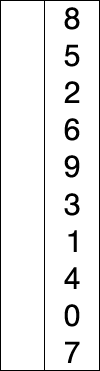

# Algorithme de Tri

### Trie à Bulle

```bash
Compare l'élément du tableau choisi avec l'élément du tableau au position supérieur à lui!
On répéte cette comparaison jusqu'à ce que notre tableau soit trier
```

#### Démo


### Trie par insertion

```bash
Compare l'élément du tableau choisi avec l'élément du tableau au position supérieur à lui!
Puis lorsque l'élément du tableau au position supérieur est inférieur au position du tableau choisi, 
alors on va placer cette élément inférieur à son position exacte (cela on comparant cette élément ci à tous les
 éléments qui est au position inférieur à lui).
```

#### Démo


### Trie par selection

```bash
On choisi un élément du tableau "( comme l'indice 0 )" que l'on va definir comme la valeur minimale puis on va tester que cette choix est correct.
On va comparer alors la valeur minimale avec l'élément du tableau si aucun des éléments present n'est inférieur que celle ci
alors on ne change rien mais dans le cas contraire on va remplacer le minimal par l'élément plus petit que lui puis on va la placer 
dans l'index 0 si c'est la plus petite élément du tableau apres on va chercher le deuxième élément plus petite et on va
la place à l'index 1 et ainsi de suite jusqu'à ce que le tableau soit trier entièrement.
```

#### Démo
